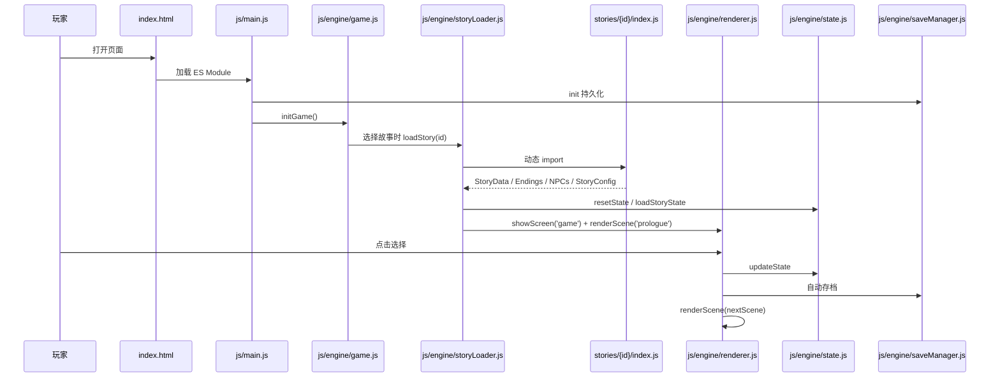
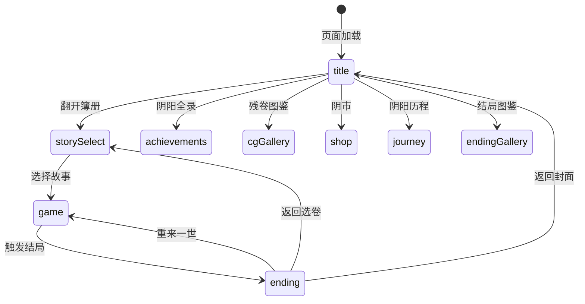

# 阴阳簿 架构文档

## 概述

《阴阳簿》是一个运行在浏览器中的**中式文字恐怖游戏集**。玩家通过阅读场景文本并做出选择推进故事，每个选择可能改变理智、阴气、时辰、物品与剧情 flag，最终导向不同的结局。系统包含七卷独立故事，它们共享同一个阴阳世界观，并通过全局 flag 和隐藏彩蛋形成跨卷联动。

项目采用纯前端架构，没有构建步骤，依赖原生 ES Modules 与浏览器 API。游戏状态保存在 `localStorage` 中，支持续读、选择记录、结局图鉴、成就与阴钱商店。

## 技术栈

**语言与运行时**
- HTML5 / CSS3 / ES2020+
- 浏览器原生 ES Modules（`<script type="module">`）
- Web Audio API（程序化生成音效）

**框架与库**
- 无第三方框架
- 自定义轻量级引擎模块

**数据存储**
- `localStorage`：存档、全局 flag、成就、阴钱、选择记录

**基础设施**
- 静态文件托管（GitHub Pages / 任意 HTTP 服务器）
- 微信小程序版本：`weapp/` 目录

**外部服务**
- 无（纯离线运行）

## 项目结构

```
project-root/
├── index.html              # 应用入口：所有屏幕 DOM
├── styles.css              # 少量全局样式
├── css/                    # 组件级样式
│   ├── pause.css
│   ├── choices.css
│   └── ...
├── js/
│   ├── main.js             # ES Module 启动入口
│   ├── engine/             # 游戏引擎核心
│   │   ├── namespace.js    # 全局命名空间 Huimen
│   │   ├── state.js        # GameState / GlobalFlags 管理
│   │   ├── storyLoader.js  # 动态加载故事 ES 模块
│   │   ├── renderer.js     # 场景渲染、选择 UI、屏幕切换
│   │   ├── game.js         # 标题/结局/按钮事件绑定
│   │   ├── effectEngine.js #  sanity/yin 特效与游戏结束检测
│   │   ├── sceneFactory.js # 场景/选择工厂函数
│   │   ├── endingFactory.js# 结局/NPC/对话工厂函数
│   │   ├── platform.js     # 浏览器/小程序/小游戏跨平台抽象
│   │   ├── saveManager.js  # localStorage 读写与迁移
│   │   ├── recordManager.js# 选择记录、复盘、导出
│   │   ├── endingManager.js# 结局处理与借命还阳
│   │   ├── endingGallery.js# 结局图鉴
│   │   ├── npcSystem.js    # NPC 好感与交互
│   │   ├── pauseManager.js # 暂停浮层
│   │   ├── achievements.js #（根目录）成就定义与引擎
│   │   ├── currency.js     #（根目录）阴钱货币系统
│   │   ├── sound.js        #（根目录）Web Audio 音效
│   │   └── cg.js           #（根目录）CG 展示与图鉴
│   └── weapp-bridge.js     # 微信小程序桥接
├── stories/                # 七卷故事数据
│   ├── manifest.js         # 故事清单
│   ├── huimen/             # 《回门》
│   ├── shouye/             # 《守夜》
│   ├── xitai/              # 《戏台》
│   ├── tishen/             # 《替身》
│   ├── heniang/            # 《河娘》
│   ├── hujia/              # 《狐嫁》
│   └── ganshi/             # 《赶尸》
├── tools/                  # 验证与测试脚本
├── test/                   # 早期测试文件
├── minigame/               # 小游戏/小游戏平台适配
├── weapp/                  # 微信小程序源码
├── reports/                # 手动生成的分析/审查报告
└── docs/                   # 用户可见的简易文档
```

**入口点**
- `index.html` - 页面加载，引入 `js/main.js`
- `js/main.js` - 初始化 SaveManager、成就、音效、CG、货币、游戏引擎
- `js/engine/game.js` - 绑定 UI 事件，触发 `gameInit`
- `js/engine/storyLoader.js` - 根据 `stories/manifest.js` 动态加载选中故事

## 子系统

### 渲染子系统
**目的**：将当前场景文本、状态、物品与选择渲染到 DOM。
**位置**：`js/engine/renderer.js`
**关键文件**：`renderer.js`、`css/choices.css`
**依赖**：`namespace.js`、`state.js`、`dom.js`、`utils.js`
**被依赖**：`game.js`、`storyLoader.js`

渲染器负责打字机效果、状态栏更新、物品栏、结局画面、故事选择卡片、成就面板以及选择按钮的折叠展示（超过 8 个选择时自动折叠）。

### 状态管理子系统
**目的**：维护当前游戏状态与跨卷全局 flag。
**位置**：`js/engine/state.js`、`js/engine/saveManager.js`
**关键文件**：`state.js`、`saveManager.js`
**依赖**：`namespace.js`
**被依赖**：几乎所有引擎模块与故事脚本

GameState 保存理智、阴气、时辰、物品、场景、历史、选择日志、复活点、NPC 状态。GlobalFlags 跨故事持久化，用于跨卷联动。

### 故事加载子系统
**目的**：按清单动态加载 ES Module 故事，并初始化状态。
**位置**：`js/engine/storyLoader.js`
**关键文件**：`storyLoader.js`、`js/engine/platform.js`
**依赖**：`namespace.js`、`state.js`、`renderer.js`、`storyExtensions.js`、`platform.js`
**被依赖**：`game.js`

加载时通过 `Platform.loadScript()` 获取故事模块。浏览器与小程序 web-view 使用动态 `import`，小游戏则使用 `stories-bundle.js` 中的预打包映射。加载完成后把模块的 `StoryData`、`Endings`、`NPCs`、`StoryConfig` 绑定到 `Huimen`，然后调用 `applyEasterEggs()` 注入跨卷彩蛋选项。

### 特效与游戏结束检测子系统
**目的**：根据 sanity/yin 触发屏幕特效，检测死亡/疯狂/永夜等全局结局。
**位置**：`js/engine/effectEngine.js`
**关键文件**：`effectEngine.js`
**依赖**：`namespace.js`、`state.js`
**被依赖**：`renderer.js`

### 工厂函数子系统
**目的**：提供可选的辅助函数，减少故事数据中的重复字段，同时保持对象字面量完全兼容。
**位置**：`js/engine/sceneFactory.js`、`js/engine/endingFactory.js`
**关键文件**：`sceneFactory.js`、`endingFactory.js`
**依赖**：无
**被依赖**：`stories/{id}/scenes/*.js`、`stories/{id}/endings/*.js`、`stories/{id}/npcs/*.js`

`sceneFactory.js` 暴露 `createScene(id, options)` 与 `createChoice(options)`；`endingFactory.js` 暴露 `createEnding(id, options)`、`createNPC(id, options)`、`createDialogueNode(nodeId, options)`、`createDialogueChoice(options)`。工厂函数只写入非空/非 undefined 的字段，未提供的字段不会出现在最终对象中。

### 跨平台兼容抽象层
**目的**：收敛浏览器、微信小程序 web-view、微信小游戏在存储、剪贴板、弹窗、脚本加载、分享等方面的差异。
**位置**：`js/engine/platform.js`
**关键文件**：`platform.js`
**依赖**：无
**被依赖**：`saveManager.js`、`storyLoader.js`、各引擎模块

`Platform.loadScript(url)` 在浏览器/小程序 web-view 中使用原生 ESM 动态 `import`，在微信小游戏中通过 `require('./js/stories-bundle.js')` 加载已打包的故事 bundle，并将 `stories/{id}/index.js` 映射到 `StoryBundles[id]`。小游戏 bundle 映射确保在无 DOM 环境下仍能正确加载故事数据。

### 音效子系统
**目的**：通过 Web Audio API 程序化生成风声、点击音、惊吓音、铜钱铃铛等。
**位置**：`sound.js`
**关键文件**：`sound.js`
**依赖**：无
**被依赖**：`main.js`

### 成就与货币子系统
**目的**：管理成就解锁与阴钱货币。
**位置**：`achievements.js`、`currency.js`
**关键文件**：`achievements.js`、`currency.js`
**依赖**：`namespace.js`、`saveManager.js`
**被依赖**：`main.js`

## 数据流程



## 屏幕状态机



## 故事模块化架构

每个故事目录按主题拆分为子模块：

```
stories/{id}/
├── index.js        # 聚合所有 scenes / endings / npcs
├── config.js       # StoryConfig：标题、默认状态、时辰映射
├── scenes/         # 场景模块，按地点/主题分组
├── endings/        # 结局数据
└── npcs/           # NPC 数据
```

这种拆分使单卷可维护性提高，同时 `storyLoader.js` 仍按统一接口读取，保持向后兼容。
