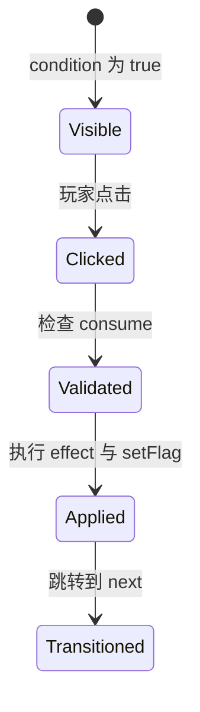
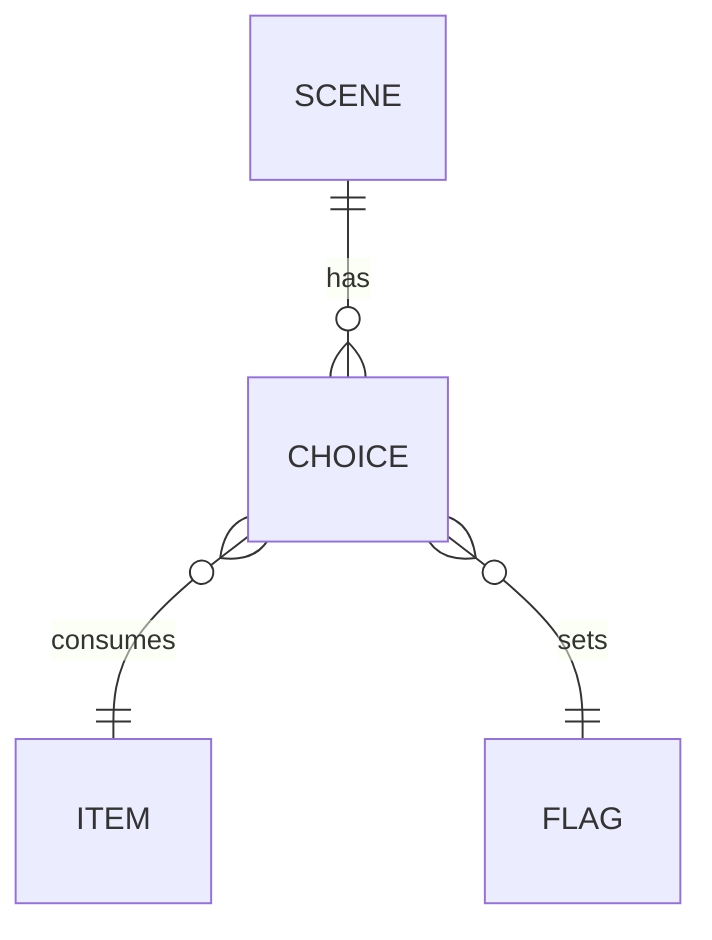

# Choice（选择）

选择是玩家与故事交互的主要方式。每个选择显示为按钮，点击后可能触发状态变化、消耗物品、设置 flag 并跳转到下一个场景或结局。

## 什么是选择？

选择连接场景与场景，是故事分支的核心机制。选择可以带条件（condition）控制是否显示，带副作用（effect）改变状态，带消耗（consume）扣除物品，带 flag 设置。

**关键特征**：
- 每个选择必须显示文本与跳转目标 `next`
- `condition` 返回 false 时按钮不显示
- `effect` 在选择被点击后立即执行
- `consume` 会在执行 effect 前检查物品是否存在

## 代码位置

| 方面 | 位置 |
|------|------|
| 数据定义 | 场景对象的 `choices` 数组 |
| 渲染 | `js/engine/renderer.js` |
| 点击处理 | `js/engine/renderer.js` |

## 结构示例

```javascript
{
  text: '用铜镜照纸人',
  next: 'paper_doll_revealed',
  condition: (state) => state.inventory.includes('copper_mirror'),
  consume: 'copper_mirror',
  effect: (state) => {
    state.sanity -= 5;
    state.yin += 10;
  },
  setFlag: { key: 'mirrorUsed', value: true, target: 'both' }
}
```

## 关键字段

| 字段 | 类型 | 描述 |
|------|------|------|
| `text` | `string` | 按钮文本 |
| `next` | `string` | 跳转目标场景/结局 id |
| `condition` | `function` | 是否显示该选项 |
| `hideIf` | `function` | 是否隐藏（与 condition 语义相反） |
| `effect` | `function` | 选择后的副作用 |
| `consume` | `string` | 消耗的物品 id |
| `setFlag` | `object` | 设置 flag，`target` 可为 game/global/both |

## 不变量

1. **目标存在**：`next` 必须指向有效的场景或结局 id
2. **消耗前置**：使用 `consume` 时，应同时用 `condition` 检查物品存在
3. **副作用幂等**：相同选择重复执行不应破坏状态（由引擎保证每次进入新场景存档）

## 生命周期



## 关系


