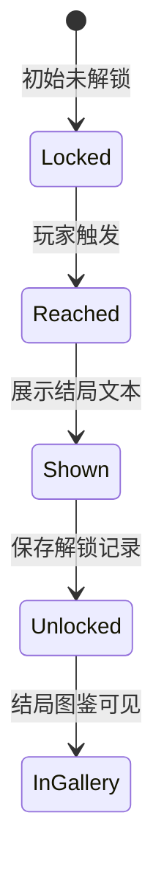
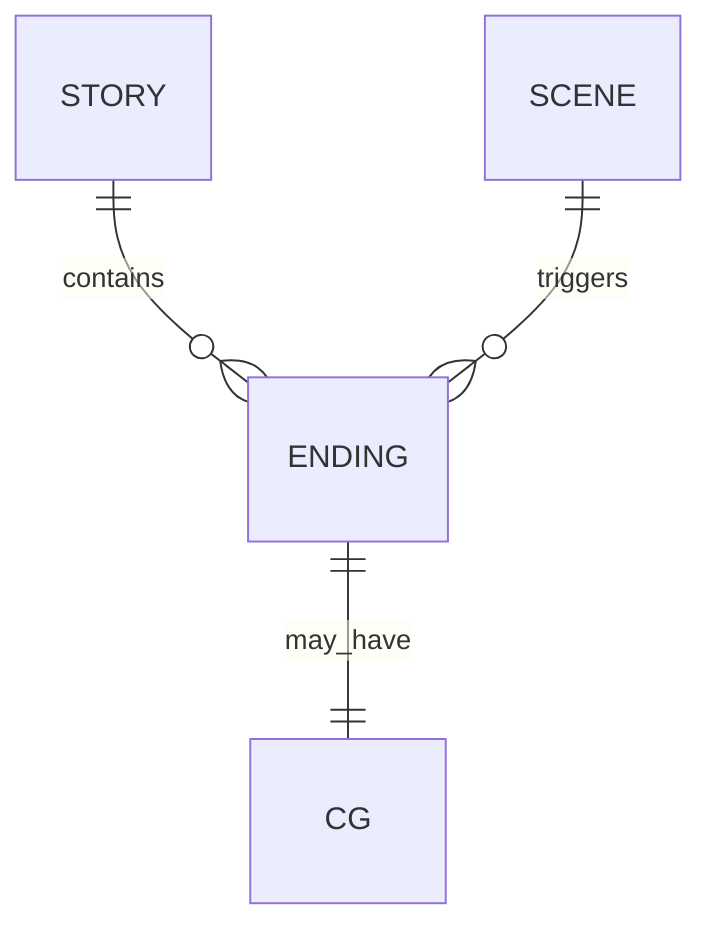

# Ending（结局）

结局是故事的终止状态。当玩家到达结局场景时，游戏展示结局标题与文本，并记录该结局已被解锁。

## 什么是结局？

结局代表玩家在本次故事中的最终命运。它可能由特定选择触发，也可能由全局状态（如 sanity 归零）强制触发。结局数据包含标题、描述、解锁条件、隐藏属性与 CG。

**关键特征**：
- 结局 id 在故事内唯一
- 结局可以设置为隐藏，未解锁时不显示在图鉴中
- 部分结局为跨卷联动结局，需要 `GlobalFlags` 满足条件
- 结局触发后，玩家可选择重来、返回选卷或返回封面

## 代码位置

| 方面 | 位置 |
|------|------|
| 数据定义 | `stories/{id}/endings/index.js` |
| 工厂函数 | `js/engine/endingFactory.js` |
| 触发逻辑 | `js/engine/endingManager.js`、`js/engine/effectEngine.js` |
| 展示 | `js/engine/renderer.js` |
| 图鉴 | `js/engine/endingGallery.js` |
| NPC 数据 | `stories/{id}/npcs/*.js` |

## 结构示例

推荐使用工厂函数定义结局：

```javascript
import { createEnding } from '../../../js/engine/endingFactory.js';

export const Endings = {
  ending_burn: createEnding('ending_burn', {
    title: '纸人替身',
    text: '你被纸人代替，成了灶膛里的一捧灰。',
    description: '被纸人取代的坏结局',
    unlockCondition: (state) => state.flags.replacedByPaperDoll,
    condition: { flag: 'replacedByPaperDoll' },
    hidden: false,
    cg: 'ending_burn_cg'
  })
};
```

对象字面量仍然完全兼容：

```javascript
export const Endings = {
  ending_burn: {
    id: 'ending_burn',
    title: '纸人替身',
    text: '你被纸人代替，成了灶膛里一捧灰。',
    hidden: false,
    cg: 'ending_burn_cg'
  }
};
```

## 关键字段

| 字段 | 类型 | 描述 |
|------|------|------|
| `id` | `string` | 唯一标识 |
| `title` | `string` | 结局标题 |
| `text` | `string` | 结局描述 |
| `description` | `string` | 结局简述，用于图鉴列表 |
| `unlockCondition` | `function` | 图鉴中显示的解锁条件提示 |
| `condition` | `object` | 触发/解锁条件 |
| `hidden` | `boolean` | 未解锁时是否隐藏 |
| `cg` | `string` | 结局 CG id |

## NPC 与对话

`endingFactory.js` 同时提供 NPC 与对话节点工厂，用于构建可交互 NPC：

```javascript
import {
  createNPC,
  createDialogueNode,
  createDialogueChoice
} from '../../../js/engine/endingFactory.js';

export const yun_po = createNPC('yun_po', {
  name: '云婆',
  title: '狐嫁媒人',
  dialogue: {
    start: createDialogueNode('start', {
      text: '你来了。狐嫁的轿子，已经等你很久了。',
      choices: [
        createDialogueChoice({ text: '你是谁？', next: 'who_are_you' }),
        createDialogueChoice({ text: '离开', exit: true })
      ]
    }),
    who_are_you: createDialogueNode('who_are_you', {
      text: '我是这山里最后一个媒人，专给活人和死人牵线。',
      choices: [
        createDialogueChoice({ text: '继续问', next: 'fox_choice' }),
        createDialogueChoice({ text: '离开', exit: true })
      ]
    })
  },
  affinity: 0,
  effects: { yin: 2 }
});
```

### NPC 关键字段

| 字段 | 类型 | 描述 |
|------|------|------|
| `id` | `string` | NPC 唯一标识 |
| `name` | `string` | NPC 名称 |
| `title` | `string` | NPC 称号 |
| `dialogue` | `object` | 对话节点图 |
| `affinity` | `number` | 初始好感度 |
| `effects` | `object` | 交互效果 |

### 对话节点关键字段

| 字段 | 类型 | 描述 |
|------|------|------|
| `id` | `string` | 节点 id |
| `text` | `string` | 节点文本 |
| `choices` | `DialogueChoice[]` | 选项列表 |
| `effects` | `object` | 进入节点时生效的效果 |
| `next` | `string` | 退出后跳转的场景 id |
| `exit` | `boolean` | 是否直接退出对话 |

## 不变量

1. **唯一性**：同一故事内结局 id 不能重复
2. **可达性**：每个结局必须至少被一个场景或全局条件触发
3. **终态**：结局触发后不再返回主线

## 生命周期



## 关系


