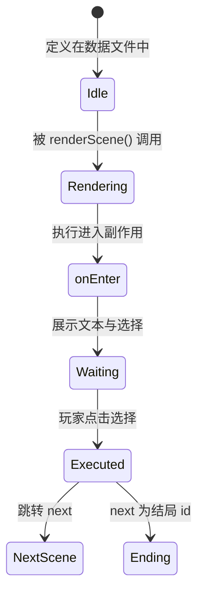
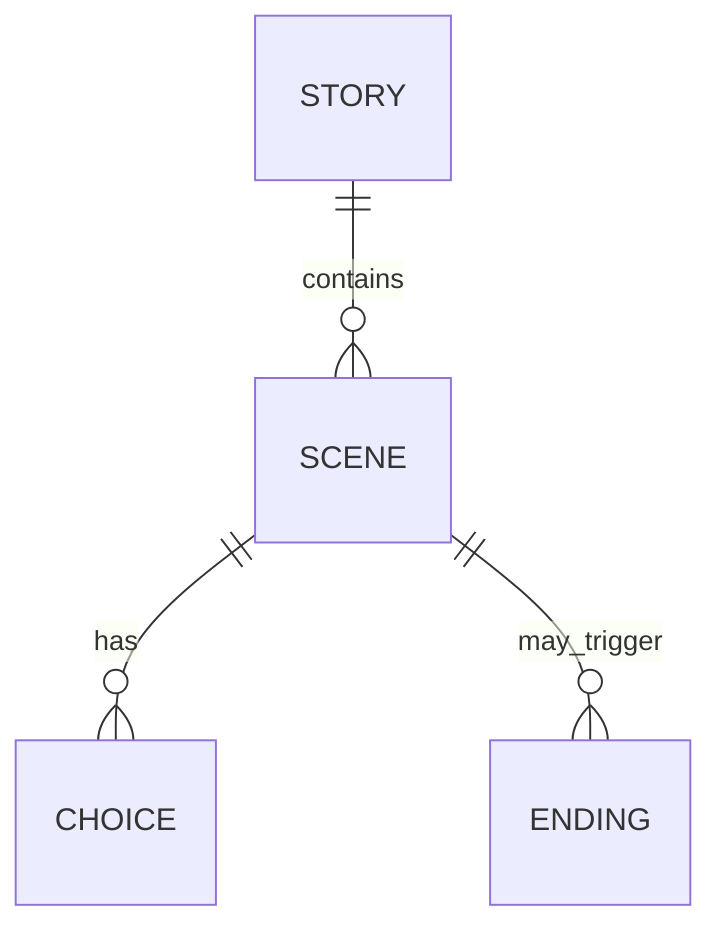

# Scene（场景）

场景是《阴阳簿》故事的最小叙事单元。每个场景由唯一 id、标题、正文、可选的进入副作用，以及一组选择组成。

## 什么是场景？

场景代表玩家在故事中的一个“当下”：一段描述性文本、若干可能的选择，以及基于当前状态触发的视觉或状态变化。场景之间通过选择的 `next` 字段构成有向图。

**关键特征**：
- 每个场景必须有唯一的 `id`
- 每个场景必须有 `title` 与 `text`
- 场景可以包含 0 到多个 `choices`
- 场景可以通过 `onEnter` 在选择展示前执行副作用

## 代码位置

| 方面 | 位置 |
|------|------|
| 数据定义 | `stories/{id}/scenes/*.js` |
| 数据聚合 | `stories/{id}/index.js` |
| 渲染 | `js/engine/renderer.js` |
| 跳转逻辑 | `js/engine/renderer.js` |

## 结构示例

```javascript
export const scenes = {
  prologue: {
    id: 'prologue',
    title: '归乡',
    text: '祖母病逝，你回到三十年未归的山村。',
    choices: [
      {
        text: '进村',
        next: 'village_gate'
      },
      {
        text: '绕去后山祖坟',
        next: 'graveyard_path',
        condition: (state) => state.flags.knowsAncestralPath
      }
    ]
  }
};
```

## 关键字段

| 字段 | 类型 | 描述 |
|------|------|------|
| `id` | `string` | 唯一标识 |
| `title` | `string` | 场景标题 |
| `text` | `string` | 正文，支持 HTML |
| `cg` | `string` | 可选 CG id |
| `onEnter` | `function` | 进入时副作用 |
| `choices` | `Choice[]` | 可选项列表 |

## 不变量

1. **id 唯一性**：同一故事内场景 id 不能重复
2. **可达性**：每个场景至少应被一个有效 `next` 引用，或作为入口场景
3. **结局终止**：触发结局的场景不应再提供返回主线的选择

## 生命周期



## 关系



| 关联概念 | 关系 | 描述 |
|------|------|------|
| Story | 属于 | 每个场景属于某个故事 |
| Choice | 包含 | 一个场景可有多个选择 |
| Ending | 可能触发 | 选择可能跳转到结局 |
