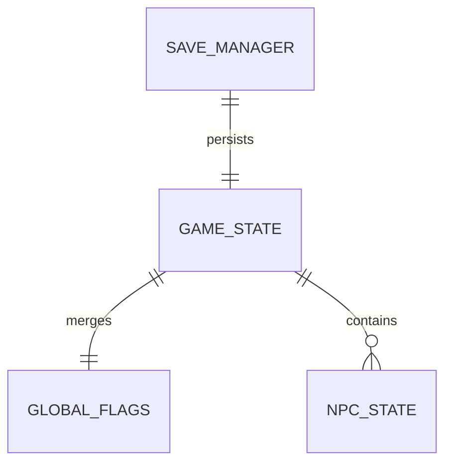

# State（状态）

状态系统是《阴阳簿》的核心。它维护玩家在当前故事中的数值、物品、flag、历史与跨卷共享信息。

## 什么是状态？

游戏状态分为三层：
- **GameState**：当前故事内的临时状态
- **GlobalFlags**：跨故事持久化的世界状态
- **NPCState**：当前故事中 NPC 的好感与交互记录

**关键特征**：
- GameState 在加载故事时初始化或从存档恢复
- GlobalFlags 在首次启动时加载，并在整个游戏生命周期中保持
- 状态写入应通过 `state.js` 提供的 API 完成，避免直接修改 `Huimen.GameState`

## 代码位置

| 方面 | 位置 |
|------|------|
| 状态管理 | `js/engine/state.js` |
| 持久化 | `js/engine/saveManager.js` |
| 命名空间 | `js/engine/namespace.js` |

## 结构示例

```javascript
const DEFAULT_STATE = {
  storyId: null,
  sanity: 100,          // 理智 0-100
  yin: 0,               // 阴气 0-100
  time: 1140,           // 游戏内分钟（从 00:00 起算）
  inventory: [],        // 物品数组
  flags: {},            // 当前故事 flag
  currentScene: 'prologue',
  history: [],          // 场景历史
  choiceLog: [],        // 选择日志
  reviveCheckpoints: [],// 可复活节点
  npcState: {}          // NPC 状态
};
```

## 关键字段

| 字段 | 类型 | 描述 |
|------|------|------|
| `sanity` | `number` | 理智值，过低触发幻觉/崩溃 |
| `yin` | `number` | 阴气值，过高可能被附体/死亡 |
| `time` | `number` | 游戏时间（分钟） |
| `inventory` | `string[]` | 物品列表 |
| `flags` | `object` | 故事 flag，加载时合并 GlobalFlags |
| `currentScene` | `string` | 当前场景 id |
| `history` | `string[]` | 访问过的场景 |
| `choiceLog` | `array` | 玩家选择记录 |
| `reviveCheckpoints` | `array` | 借命还阳可用节点 |
| `npcState` | `object` | NPC 好感等 |

## 不变量

1. **数值范围**：`sanity` 与 `yin` 应保持在 0–100 之间
2. **白名单写入**：`updateState` 只能写入允许键
3. **存档校验**：加载存档时缺失字段会被填充默认值

## 生命周期

```mermaid
stateDiagram-v2
    [*] --> Default: 应用启动
    Default --> GlobalLoaded: 加载 GlobalFlags
    GlobalLoaded --> Reset: 新故事 / 强制重置
    GlobalLoaded --> Restored: 读取存档
    Reset --> Playing: 渲染 prologue
    Restored --> Playing: 渲染 currentScene
    Playing --> Saved: 玩家选择后自动存档
```

## 关系


