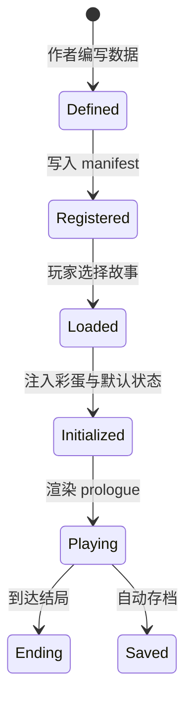
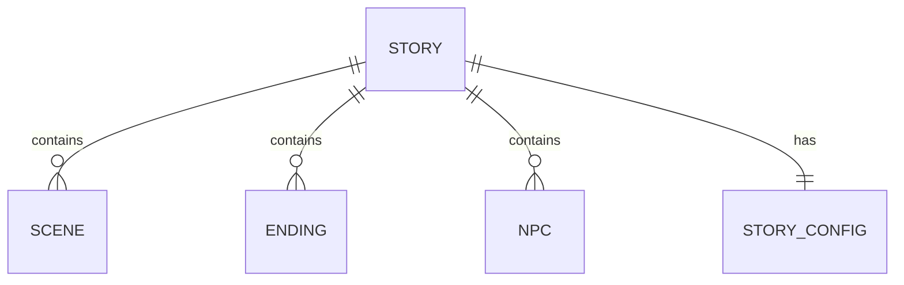

# Story（故事）

故事是《阴阳簿》的可玩一卷。七卷故事共享同一个阴阳世界观，但每卷独立成篇，拥有自己独立的场景、结局、NPC 与配置。

## 什么是故事？

故事是一组场景组成的有向叙事图，加上结局集合、可选的 NPC 集合，以及故事级配置。玩家从 `prologue` 开始，通过选择推进，最终到达某个结局。

**关键特征**：
- 每个故事在 `stories/manifest.js` 中注册
- 每个故事通过 `stories/{id}/index.js` 导出 `StoryData`、`Endings`、`NPCs`
- 故事可以选择性导出 `StoryConfig` 覆盖默认状态
- 故事加载时，`storyExtensions.js` 会注入跨卷彩蛋选项

## 代码位置

| 方面 | 位置 |
|------|------|
| 清单 | `stories/manifest.js` |
| 入口 | `stories/{id}/index.js` |
| 配置 | `stories/{id}/config.js` |
| 场景 | `stories/{id}/scenes/*.js` |
| 结局 | `stories/{id}/endings/index.js` |
| NPC | `stories/{id}/npcs/index.js` |

## 结构示例

```javascript
// stories/manifest.js
{
  id: 'huimen',
  title: '回门',
  subtitle: '冥婚 · 纸人 · 山村',
  description: '祖母病逝，你回到三十年未归的山村……',
  difficulty: '中等',
  horrorLevel: 9,
  playTime: '30–45 分钟',
  tags: ['冥婚', '复仇', '家族罪孽'],
  scriptPath: 'stories/huimen/index.js'
}
```

## 关键字段

| 字段 | 类型 | 描述 |
|------|------|------|
| `id` | `string` | 唯一标识 |
| `title` | `string` | 故事标题 |
| `subtitle` | `string` | 副标题，展示主题词 |
| `description` | `string` | 故事简介 |
| `difficulty` | `string` | 难度 |
| `horrorLevel` | `number` | 恐怖等级 1-10 |
| `playTime` | `string` | 预计游玩时间 |
| `tags` | `string[]` | 标签 |
| `scriptPath` | `string` | ES 模块入口路径 |

## StoryConfig

```javascript
// stories/huimen/config.js
export const StoryConfig = {
  title: '回门',
  defaultState: {
    sanity: 100,
    time: 1140,
    flags: {}
  },
  timePhases: [
    { name: '戌时三刻', start: 1140, end: 1200 },
    { name: '亥时', start: 1200, end: 1320 }
  ]
};
```

## 不变量

1. **入口场景**：每个故事必须存在 `prologue` 场景
2. **结局可达**：每个结局必须至少被一个场景引用（全局状态结局除外）
3. **清单一致**：`stories/manifest.js` 中的 `scriptPath` 必须指向正确的 `index.js`

## 生命周期



## 关系


